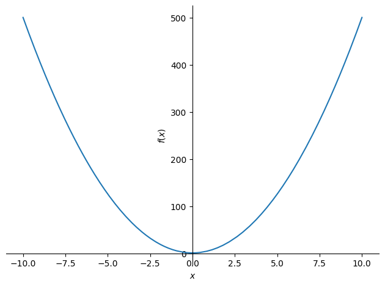
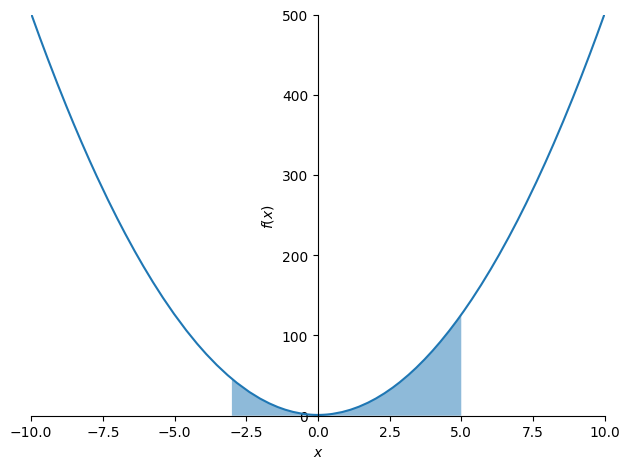

# Homework 2 (with answers)

1. Evaluate and simplify the following expressions:
   * $ 10^5 10^{-3} $
   * $ \text{log}_{10}1000 $
   * $ \text{log}_{2}{32} $
   * $ 25^{3/2} $

**Answers:**

   * $ 10^5 10^{-3} = 100 $
   * $ \text{log}_{10}1000 = 3 $
   * $ \text{log}_{2}{32} = 4 $
   * $ 25^{3/2} = 125 $


```python
from sympy import log 
```


    100.0


```python
10**5 * 10**(-3)
```


    100.0


```python
log(1000, 10)
```


$\displaystyle 3$


```python
log(32,2)
```


$\displaystyle 5$


```python
25**(3/2)
```


    125.0


2. Label each of these as either rational or irrational:
   * 67.2715882509
   * $ e $
   * $ sqrt{2} $
   * $ \pi $
   * 25/2
   * 2/3
   * 1577

**Answers:**
  
   * 67.2715882509 **(RATIONAL)**
   * $ sqrt{2} $ **(IRRATIONAL)**
   * $ \pi $ **(IRRATIONAL)**
   * 25/2 **(RATIONAL)**
   * 2/3  **(RATIONAL)**
   * 1577  **(RATIONAL)**

3. Evaluate this expression:

   $ \Large \text{lim}_{x \to 15} ( \frac{3}{(x-15)^2} + 5) $ 


```python
from sympy import * 

x = symbols('x')
f = 3 / (x-15)**2 + 5

limit(f,x,15)
```


$\displaystyle \infty$


4. Evaluate this expression:

   $ \Large \text{lim}_{x \to \infty} (\frac{3}{(x-15)^2} + 5)$ 


```python
from sympy import * 

x = symbols('x')
f = 3 / (x-15)**2 + 5

limit(f,x,oo)
```


$\displaystyle 5$


5. Calculate the slope of this function at $ x = 3 $ 

    $ \Large f(x) = 2x^3 + 1 $ 


```python
from sympy import * 

x = symbols('x')
f = 2*x**3 + 1

diff(f,x).subs(x,3)
```


$\displaystyle 54$


6. Perform gradient descent on this function to find its minimum.

   $ \Large f(x) = 5x^2 + 1 $ 

Calculate the derivative. 


```python
from sympy import * 

x = symbols('x')
f = 5*x**2 + 1 

dx_f = diff(f,x)
dx_f
```


$\displaystyle 10 x$


Plot the function for verification


```python
plot(f)
```


    

    


    <sympy.plotting.plot.Plot at 0x118de8bd0>


Perform gradient descent.


```python
def f(x): return 5*x**2 + 1 
def dx_f(x): return 10*x

L = .05 
x = 0
for i in range(1000): 
    x -= L*dx_f(x)

print(x, f(x))
```

    0.0 1.0


7. Calculate the under this function from $ x = -3 $ through $ x = 5 $.

    $ \Large f(x) = 5x^2 + 1 $ 


```python
from sympy import * 

x = symbols('x')
f = 5*x**2 + 1 

integrate(f,(x,-3, 5))
```


$\displaystyle \frac{784}{3}$


Plot area just for good measure. 


```python
from sympy import * 
import numpy as np 


x_array = np.linspace(-3, 5, 1000)
f_array = lambdify(x, f)(x_array)

plot(f, xlim=(-10,10), ylim=(-1,500), fill={'x': x_array,'y1':f_array, 'alpha': .5}) 
```


    

    


    <sympy.plotting.plot.Plot at 0x11ebeb550>


