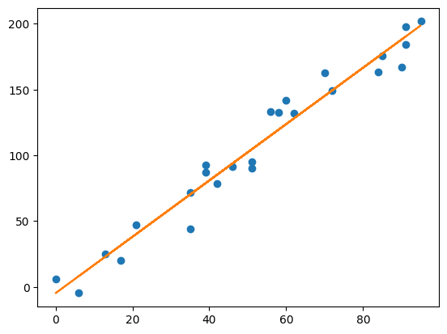

## Homework 5 (with answers)

1. You have a dataset of an input variable $ x $ and an output variable $ y $ below. Complete the code below to fit a linear regression using scikit-learn, and identify the coefficients for the slope and intercept. Don't worry about train/test splits for now. 


```python
import numpy as np 
import matplotlib.pyplot as plt
from sklearn.linear_model import LinearRegression

X = np.array([91,70,95,6,56,13,46,21,72,35,91,35,84,62,51,39,17,58,42,60,39,85,51,0,90]).reshape(-1, 1)

Y = np.array([184.2,162.5,201.8,-4.4,133.0,25.2,91.4,47.2,149.0,43.9,197.9,71.7,163.1,
              132.2,94.9,92.8,20.1,132.7,78.3,141.6,87.4,175.9,90.0,5.8,167.3])

# Fit a line to the points
fit = LinearRegression().fit(X, Y)

# m = 1.7867224, b = -16.51923513
m = fit.coef_.flatten()
b = fit.intercept_.flatten()
print("m = {0}".format(m))
print("b = {0}".format(b))

# show in chart
plt.plot(X, Y, 'o') # scatterplot
plt.plot(X, m*X+b) # line
plt.show()
```

    184.2,162.5,201.8,-4.4,133.0,25.2,91.4,47.2,149.0,43.9,197.9,71.7,163.1,132.2,94.9,92.8,20.1,132.7,78.3,141.6,87.4,175.9,90.0,5.8,167.3
    m = [2.14117547]
    b = [-4.69194738]


    

    


2. Fit a logistic regression to [this data](https://bit.ly/3imidqa) that predicts a light/dark font for a given background color. Each data point contains red, green, and blue values composing the given background color and an output variable column indicating whether it belongs to a light (0) or dark (1) background color. Complete the code below by replacing the question marks and the indicated comment blocks. 


```python
import pandas as pd
from sklearn.linear_model import LogisticRegression
import numpy as np

# Load the data
df = pd.read_csv("https://bit.ly/3imidqa", delimiter=",")

# Extract input variables (all rows, all columns but last column)
X = df.values[:, :-1]

# Extract output column (all rows, last column)
Y = df.values[:, -1]

model = LogisticRegression(solver='liblinear')

model.fit(X, Y)

# Test a prediction
while True:
    n = input("Input a color {red},{green},{blue}: ")
    (r, g, b) = n.split(",")
    x = model.predict(np.array([[int(r), int(g), int(b)]]))
    if model.predict(np.array([[int(r), int(g), int(b)]]))[0] == 0.0:
        print("LIGHT")
    else:
        print("DARK")
```

3. Is there a strong correlation between $ X $ and $ Y $ below? Find the correlation coefficient, coefficient of determination, and p-value of the data.


```python
import numpy as np 
import pandas as pd 
import matplotlib.pyplot as plt
from sklearn.linear_model import LinearRegression

X = np.array([91,70,95,6,56,13,46,21,72,35,91,35,84,62,51,39,17,58,42,60,39,85,51,0,90])

Y = np.array([162.9,159.2,206.6,-21.9,109.5,26.7,103.7,51.6,136.7,57.8,192.9,52.9,193.0,
              139.6,66.2,96.1,43.3,139.8,76.1,163.1,88.6,157.4,76.2,21.2,138.9]) 

df = pd.DataFrame({"X": X, "Y" : Y})

# Calculate the correlation coefficient, coefficient of determination, and p-value below 
# ==========================================
print("Correlation Coefficient")
df.corr(method='pearson')
# ==========================================
```

    Correlation Coefficient


<div>
<style scoped>
    .dataframe tbody tr th:only-of-type {
        vertical-align: middle;
    }

    .dataframe tbody tr th {
        vertical-align: top;
    }

    .dataframe thead th {
        text-align: right;
    }
</style>
<table border="1" class="dataframe">
  <thead>
    <tr style="text-align: right;">
      <th></th>
      <th>X</th>
      <th>Y</th>
    </tr>
  </thead>
  <tbody>
    <tr>
      <th>X</th>
      <td>1.00000</td>
      <td>0.93405</td>
    </tr>
    <tr>
      <th>Y</th>
      <td>0.93405</td>
      <td>1.00000</td>
    </tr>
  </tbody>
</table>
</div>


```python
print("Coefficient of Determination")
df.corr(method='pearson') ** 2
```

    Coefficient of Determination


<div>
<style scoped>
    .dataframe tbody tr th:only-of-type {
        vertical-align: middle;
    }

    .dataframe tbody tr th {
        vertical-align: top;
    }

    .dataframe thead th {
        text-align: right;
    }
</style>
<table border="1" class="dataframe">
  <thead>
    <tr style="text-align: right;">
      <th></th>
      <th>X</th>
      <th>Y</th>
    </tr>
  </thead>
  <tbody>
    <tr>
      <th>X</th>
      <td>1.000000</td>
      <td>0.872449</td>
    </tr>
    <tr>
      <th>Y</th>
      <td>0.872449</td>
      <td>1.000000</td>
    </tr>
  </tbody>
</table>
</div>


```python
from scipy.stats import t
from math import sqrt 

n = len(X)
lower_cv = t(n-1).ppf(.025)
upper_cv = t(n-1).ppf(.975)

# correlation coefficient
r = 0.872449

# Perform the test
test_value = r / sqrt((1-r**2) / (n-2))

print("TEST VALUE: {}".format(test_value))
print("CRITICAL RANGE: {}, {}".format(lower_cv, upper_cv))

if test_value < lower_cv or test_value > upper_cv:
    print("CORRELATION PROVEN, REJECT H0")
else:
    print("CORRELATION NOT PROVEN, FAILED TO REJECT H0 ")

# Calculate p-value
if test_value > 0:
    p_value = 1.0 - t(n-1).cdf(test_value)
else:
    p_value = t(n-1).cdf(test_value)

# Two-tailed, so multiply by 2
p_value = p_value * 2
print("P-VALUE: ", p_value)
```

    TEST VALUE: 8.561641415754337
    CRITICAL RANGE: -2.063898561628021, 2.063898561628021
    CORRELATION PROVEN, REJECT H0
    P-VALUE:  9.302190351334616e-09

